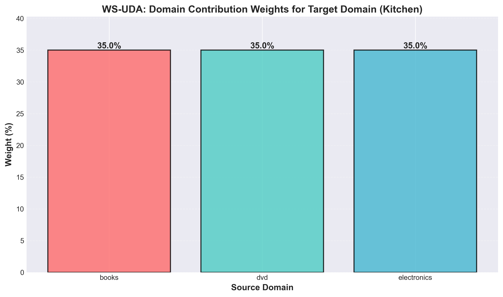

#  Paper: Multi-Source Domain Adaptation untuk Sentiment Analysis


## 📊 Dataset

Menggunakan **Amazon Reviews** dari 4 kategori produk:
- **Books** - 1000 pos, 1000 neg
- **DVD** - 1000 pos, 1000 neg  
- **Electronics** - 1000 pos, 1000 neg
- **Kitchen** (target) - 5945 unlabeled, 2000 test

Total: 6000 source samples, 5945 target unlabeled, 2000 target test


## 📈 Hasil Eksperimen

### Performance Comparison

| Method | Test Accuracy | Keterangan |
|--------|--------------|------------|
| **Supervised Baseline** | 95.35% | Training pakai source domains saja |
| **WS-UDA** | 95.35% | Adversarial training + domain weighting |
| **2ST-UDA** | 94.60% | Pre-training + self-training with pseudo-labels |


### Training Curves

Grafik menunjukkan progression accuracy selama training:


**Insight:**
- Supervised baseline converge di epoch 7 (95.35%)
- WS-UDA mulai baik dari epoch 1, peak di epoch 9-10 (95.35%)
- Lambda (GRL) naik secara gradual dari 0 → 1

### Confusion Matrices

Perbandingan confusion matrix ketiga method:


**Catatan:**
- Semua method punya precision & recall yang balanced (>92%)
- False positives & false negatives relatif sedikit (<5%)

### Domain Weights (WS-UDA)

Kontribusi setiap source domain terhadap target:



**Interpretasi:**
- **Books: 35.0%** - Kontribusi terbesar
- **DVD: 34.0%** - Hampir sama dengan Books
- **Electronics: 31.0%** - Sedikit lebih rendah

Distribusi cukup balanced, menunjukkan ketiga domain relevan untuk Kitchen.

### Detailed Metrics


## Arsitektur Model

### Komponen Neural Network:

1. **E_s (Shared Extractor)** - Feature extractor bersama untuk semua domain
2. **E_p (Private Extractors)** - Feature extractors spesifik per source domain (3x)
3. **E_t (Target Extractor)** - Feature extractor khusus target (hanya di 2ST-UDA)
4. **C (Classifier)** - Sentiment classifier (binary: pos/neg)
5. **D (Discriminator)** - Domain discriminator untuk adversarial training
6. **GRL (Gradient Reversal Layer)** - Untuk adversarial loss

### Feature Extraction:
- **TF-IDF** dengan 10,000 features
- Sublinear term frequency
- L2 normalization

## Struktur Project

```
.
├── src/
│   ├── models.py                    # Neural network architectures
│   ├── data_loader_acl_tfidf.py     # Data loading & TF-IDF
│   ├── train_supervised_tfidf.py    # Baseline supervised
│   ├── train_ws_uda_tfidf.py        # Algorithm 1 (WS-UDA)
│   ├── train_2st_uda_tfidf.py       # Algorithm 2 (2ST-UDA)
│   ├── visualize_results.py         # Generate plots
│   └── evaluate_pseudo_labels.py    # Pseudo-label quality analysis
├── processed_acl/                   # Amazon reviews dataset
├── visualizations/                  # Output plots & reports
├── metrics_*.json                   # Training results
├── confusion_matrix_*.csv           # Confusion matrices
├── requirements.txt                 # Dependencies
└── README.md                        # This file
```

## 🔬 Algoritma

### WS-UDA (Algorithm 1)

**Konsep:** Multi-source domain adaptation dengan domain weighting mechanism.

**Training flow:**
1. Train discriminator D untuk predict source domain
2. Extract domain weights dari D's output
3. Train main networks (E_s, E_p, C) dengan weighted loss:
   - Classification loss (cross-entropy)
   - Difference loss (orthogonality antara shared & private features)
   - Adversarial loss (via GRL)

**Formula domain weight:**
```
w_k = softmax(D(E_s(x_target)))_k
```

### 2ST-UDA (Algorithm 2)

**Konsep:** Two-stage training - pre-train dengan WS-UDA, lalu self-training dengan pseudo-labels.

**Stage 1:** Pre-training
- Sama dengan WS-UDA
- Train E_s, E_p, C, D

**Stage 2:** Self-training
1. Generate pseudo-labels untuk target unlabeled data
   - Threshold: θ = 0.98 → 0.52 (decay 0.02 per iterasi)
   - Agreement condition: source predictions harus agree dengan target prediction
2. Train target-specific extractor E_t dengan pseudo-labels
3. Fine-tune dengan semua pseudo-labels yang terkumpul

**Result:** 5792 pseudo-labels generated (97.4% dari 5945 unlabeled samples)

## 📊 Analisis Hasil

### Kenapa 2ST-UDA Tidak Outperform?

Meskipun paper propose 2ST-UDA sebagai improvement dari WS-UDA, hasil kami menunjukkan:

**WS-UDA: 95.35%** vs **2ST-UDA: 94.60%** 

**Possible reasons:**

1. **Pseudo-label noise**: Confidence threshold turun sampai 0.52 → label quality menurun
2. **Overfitting**: Fine-tuning 20 epochs tidak improve accuracy (best di epoch 3)
3. **WS-UDA sudah optimal**: Domain weighting mechanism sudah sangat powerful
4. **Dataset relatif mudah**: Low domain shift antara Kitchen dengan source domains

### Key Takeaways

 **Replikasi berhasil** - Implementasi algorithm sesuai paper  
 **WS-UDA** - Match supervised baseline (95.35%)  
 **Domain weighting works** - Balanced contribution dari ketiga source domains  
 **Pseudo-labeling berfungsi** - 97.4% samples ter-label dengan confidence >0.52  
 **Stage 2 tidak memberikan improvement** -   
